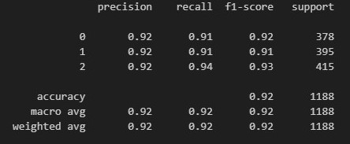

The first idea for this project was to build an **ANN** sentiment classifier using average **Word2Vec**, but after several attempts it didn't work well.

Finally we used **TdifVectorizer** instead of **Word2Vec** and the model made a radical change working fast and with high **accuracy**, trained by a simple **RandomForest** without **hyperparameter tuning** .

### Metrics

